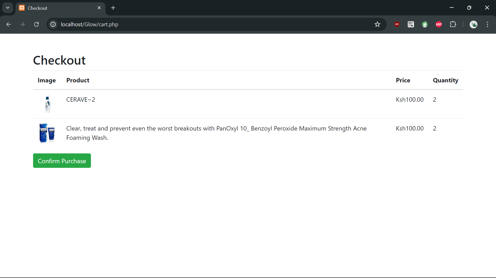

# Glow By Skin E-Commerce Store 🌟

Welcome to the **Glow By Skin** E-Commerce Store! This project is an e-commerce store for beauty products. The application allows users to view products, add them to the cart, and checkout. No payment is processed, and a confirmation email is sent upon checkout.

## 📋 Table of Contents
- [Prerequisites](#prerequisites)
- [Installation](#installation)
- [Database Setup](#database-setup)
- [Folder Structure](#folder-structure)
- [Running the Project](#running-the-project)
- [Adding Images](#adding-images)
- [User Workflow](#user-workflow)
- [Features](#features)
- [Screenshots](#screenshots)

## 📌 Prerequisites
- 🛠️ XAMPP or any web server with PHP and MySQL
- 🌐 A web browser
- 📝 A text editor (e.g., Visual Studio Code)
- 💻 Basic PHP Skills

## 🚀 Installation
1. Clone the repository to your local machine.
2. Move the project folder to the `htdocs` directory of your XAMPP installation directory in your file explorer.

## 🗄️ Database Setup
1. Start XAMPP and ensure that Apache and MySQL services are running.
2. Open phpMyAdmin and create a new database named `glow_by_skin`.
3. Create a `products` table using the following SQL script:
   ```sql
   CREATE TABLE products (
       product_id INT AUTO_INCREMENT PRIMARY KEY,
       image_path VARCHAR(255) NOT NULL,
       price DECIMAL(10, 2) NOT NULL,
       name VARCHAR(255) NOT NULL,
       description TEXT NOT NULL
   );
   ```

4. Create another table named `cart` using the following SQL script:
   ```sql
   CREATE TABLE cart (
      cart_id INT AUTO_INCREMENT PRIMARY KEY,
      product_id INT NOT NULL,
      session_id VARCHAR(255) NOT NULL,
      FOREIGN KEY (product_id) REFERENCES products(product_id)
   );
   ```

5. Users Table: Add a table for storing user credentials.
   ```sql
   CREATE TABLE users (
      id INT AUTO_INCREMENT PRIMARY KEY,
      username VARCHAR(50) NOT NULL UNIQUE,
      email VARCHAR(100) NOT NULL UNIQUE,
      password VARCHAR(255) NOT NULL,
      created_at TIMESTAMP DEFAULT CURRENT_TIMESTAMP
   );
   ```

## 🗂️ Folder Structure
   ```text
   Glow_by_skin/
   ├── database/
   │   └── image-query.php
   ├── authentication/
   │   └── login.php
   │   └── register.php
   │   └── logout.php
   ├── beauty_images/

   ├── includes/
   │   ├── config.php
   │   ├── desktopnav.php
   ├── beauty_images/ (your images directory)
   ├── add_to_cart.php
   ├── cart.php
   ├── checkout.php
   ├── contact.php
   ├── about.php
   ├── index.php
   ├── ... (other necessary image files)
   ```

## ▶️ Running the Project
- Start your local server (e.g., XAMPP) and navigate to [http://localhost/Glow/](http://localhost/Glow/) to view the homepage.

## 📸 Adding Images
1. Place your images in the `beauty_images` directory.
2. The `image-query.php` script will automatically insert image paths into the database when you load the project.
3. This script is included in `index.php` to ensure images are only added if they do not already exist in the database.

## 🧭 User Workflow
1. **Home Page**:
   - Users can browse products and view product details.
2. **Login/Register**:
   - Users can log in or register. If a user doesn't have an account, they can register via a link on the login page.
   - Registration includes a confirm password feature to ensure passwords match.
3. **Cart**:
   - Users can add products to the cart.
4. **Checkout**:
   - Users can proceed to checkout. No payment is processed, and a confirmation email is sent upon checkout.

## 🌟 Features
- 🛒 **Add to Cart**: Users can easily add products to their cart and view them before checkout.
- 🔐 **User Authentication**: Secure login and registration process with password hashing and validation.
- 🖼️ **Image Management**: Automatic image insertion into the database.
- 📧 **Email Confirmation**: Users receive a confirmation email upon checkout.
- 🖥️ **Responsive Design**: The application is designed to be responsive and user-friendly.

## 📷 Screenshots
### Home Page


### Login Page


### Registration Page


### Cart Page


---

By following these steps and the provided `README`, you should be able to set up and run your project smoothly without encountering the issue of the images not being loaded to the website. 🎉